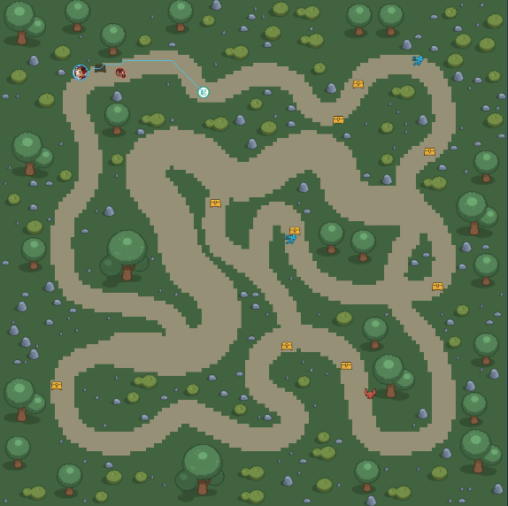

现在回顾这次比赛，我们为什么能赢。我觉得我们赢在了战略上，当所有的队伍都在卷算法设计和网络设计的时候，我们队伍明确了具体的战略目标：先提高单智能体水平，然后全力卷多智能体合作对抗。于是，当所有其他队伍都将大部分注意力集中在单智能体水平上时，我们队伍将更多的目光投入到多智能体合作中。如果大家看过我们和清华在第二届开悟中的AI对战视频，就能明显发现这一点，我们的团战水平高于清华，而单智能体水平低于清华。这其实也是有一个小插曲的，因为我们设计的网络很复杂，笔者当初把貂蝉的特征提取网络接到了李元芳的决策网络中，导致李元芳通过貂蝉的特征进行决策，这件事情在最后的code review过程中才被发现。。。但已经没有时间修复了，因此李元芳的表现相当弱智，严重拖了后腿。（这件事情说明code review是多么的重要，最后差了清华4分，直接损失10w奖金除了战略方向外，还有一个很关键的点就是注意训练资源。很多改进方法只有在训练资源足够的条件下才有用，如果你能拿出几万个core参与训练，那么OpenAI在dota2上的经验，你确实可以参考。但在此次训练资源最多只有1024个core，经典论文中的很多方法是没用的。最典型的例子就是teamspirit参数，这是控制个人和团队奖励的比例因子。你会发现在训练王者荣耀AI的过程中，过大的teamspirit是完全没用的。3. 总体框架开悟平台做的非常好，他们构建了一整套的训练平台和高效的王者荣耀gamecore，这是一个经典的 CTCE 的 AC 分布式训练架构。因此比赛选手只需要专注于算法部分即可。从下图可以看到，训练框架是一个异步框架，分为三部分，第一部分是actor，在本次比赛中总共有1024个core，它们负责采集数据，第二部分是memory pool，负责接受采集到的数据并将数据传给learner，第三部分即是learner，比赛的配置大概是8个core和一个GPU，learner负责不断从memory pool拿到数据并进行train，actor和learner是并行执行的，他们之间的速率比需要靠自己进行调节（样本利用率），比如用sleep的办法（其他办法也很简单，只需要在learner端加点矩阵乘法加在loss上拖延时间就可以了，乘以一个非常小的权值，故意消耗算力）。

除了战略方向外，还有一个很关键的点就是注意训练资源。很多改进方法只有在训练资源足够的条件下才有用，如果你能拿出几万个core参与训练，那么OpenAI在dota2上的经验，你确实可以参考。但在此次训练资源最多只有1024个core，经典论文中的很多方法是没用的。最典型的例子就是teamspirit参数，这是控制个人和团队奖励的比例因子。你会发现在训练王者荣耀AI的过程中，过大的teamspirit是完全没用的。

开悟平台做的非常好，他们构建了一整套的训练平台和高效的王者荣耀gamecore，这是一个经典的 CTCE 的 AC 分布式训练架构。因此比赛选手只需要专注于算法部分即可。从下图可以看到，训练框架是一个异步框架，分为三部分，第一部分是actor，在本次比赛中总共有1024个core，它们负责采集数据，第二部分是memory pool，负责接受采集到的数据并将数据传给learner，第三部分即是learner，比赛的配置大概是8个core和一个GPU，learner负责不断从memory pool拿到数据并进行train，actor和learner是并行执行的，他们之间的速率比需要靠自己进行调节（样本利用率），比如用sleep的办法（其他办法也很简单，只需要在learner端加点矩阵乘法加在loss上拖延时间就可以了，乘以一个非常小的权值，故意消耗算力）。

4. 算法设计对于dual-clip PPO我就不介绍了，它在腾讯的论文中有提到，每一届选手应该都用上了。效果会有那么一点，但是不是很多。这里重点介绍一下我们自己的一些小trick。4.1 动作约束函数如果你们训练过王者AI就会发现，英雄有时候会陷入no action状态，站着不动、惩戒等技能胡乱释放。这是因为这些state并没有加入reward系统中。假如你能对这些行为进行惩罚，其实就解决了。但在reward系统中并不是所有的state都可以拿到，这时候可以通过添加损失函数来间接实现：

## 动作掩码损失

\[
loss_{action} = \sum_{j=1}^{batch} \sum_{i=1}^{n} (A_{ij} * Mask_i - 0)^2
\]

比如你希望 agent 选中 no action 的概率是 0，那么只需要将 Mask 向量对应元素设置为 1 即可。这项技术与其说是一个 trick，不如说是一种思想。（前不久我还看到一篇 RL 的顶会，也是类似的思想，他具体的 trick 是将两个相邻时刻的 value 网络的中间层做一个相似度的 loss，以加大 agent 的探索，大家也可以将这篇论文的 idea 用到开悟里，感觉会有一点效果）

为什么说这是一个思想呢，一般的 PPO 有三个 loss 子项，分别是 policy、value、entropy。我们的 \( loss_{action} \) 是从 action 出来的，因此考虑对 policy loss 的影响。这个 \( loss_{action} \) 就像是叠加在 \( loss_{policy} \) 上一样，\( loss_{policy} \) 的形式如下：

\[
loss_{policy} = E_{\pi(\theta_k)} [\min \left( \frac{\pi(A_t | S_t; \theta)}{\pi(A_t | S_t; \theta_k)} a_{\pi(\theta_k)}(S_t, A_t), a_{\pi(\theta_k)}(S_t, A_t) + \varepsilon | a_{\pi(\theta_k)}(S_t, A_t) \right)]
\]

对于 \( a_{\pi(\theta_k)}(S_t, A_t) \) 而言：

\[
a_{\pi(\theta_k)}(S_t, A_t) = G_t - B(S_t)
\]

其中的 \(G_t\) 代表 t 时刻的长期奖励，\(B(S_t)\) 代表 t 时刻的一个与 action 无关的基线函数，用于降低学习过程中的方差。因此 \(loss_{action}\) 就相当于对 \(G_t\) 做了一个减法，相当于间接的设置了一个奖励项。在实战中，当很多队伍还在站着不动的时候，我们通过添加 \(loss_{action}\)，只需要 1 个小时的训练就能完全规避这个问题，并且还可以对这个 loss 设置具体的权重因子，比如对技能释放的惩罚。我们通过这种方式实现了惩戒的精准释放，打野的惩戒捏得非常紧。

除此之外，你甚至能通过复杂的action loss进行设置，用来规诫agent的行为（我们没这么做，但是这样确实可以），这本质上也是一个设置reward的手段。（但现在腾讯开放了更多的state细节，在reward系统上做这些更快

4.2 self-play算法如果你需要尝试不同的网络设计方案，聪明的做法不是做网络迁移，因为RL的网络往往非常脆弱，极易训崩。比较推荐的是用之前的模型作为教师模型，让现在的模型能快速达到之前的水平。对于self-play，腾讯提供的baseline是naive self-play，每次选择博弈有30%等概率选择历史模型池中的模型进行博弈。大家其实可以换成OpenAI Five中提高的评分机制，这可能对训练有一点帮助，之前我在1v1模式中实现了它，在后续训练中，模型能力退化现象有所好转。（当然，如果你有什么好的self play想法也可以尝试

可以把自己训练的几个比较强的模型直接固定在策略池中，能稍微减轻策略退化的速度。自博弈产生的模型则根据评分函数决定去留和被select的概率。

4.3 多agent的policy损失函数
这个其实不能算trick，因为腾讯已经做进去了。但大家可以思考一下。对于多智能体 policy 的损失函数，应当是联合动作的损失函数还是动作的损失函数之和呢？如果采用联合动作的损失函数，那联合损失函数就表达为如下形式：

\[
\frac{\pi(A_t | S_t; \theta)}{\pi(A_t | S_t; \theta_k)} = \frac{\pi_1(A_t^1 | S_t^1; \theta^1)}{\pi_1(A_t^1 | S_t^1; \theta_k)} \cdot \frac{\pi_2(A_t^2 | S_t^2; \theta^2)}{\pi_2(A_t^2 | S_t^2; \theta_k)} \cdots \frac{\pi_n(A_t^n | S_t^n; \theta_n^n)}{\pi_n(A_t^n | S_t^n; \theta_k)}
\]

其中的数字上下标代表着 agent 的编号，如果某一个 agent 出现了比例异常的现象，那么整个联合损失函数也就异常了。这将极大的降低样本的利用率。如果采用 policy 的损失函数之和，某一个 agent 的 \(\frac{\pi_2(A_t^2 | S_t^2; \theta_n^n)}{\pi_2(A_t^2 | S_t^2; \theta_k)}\) 异常不会影响其他的 agent，这将极大提高样本的利用率。

但换种角度思考，如果我们拥有无限的训练资源，最好的算法当然是将整个 3v3 做成单智能决策问题，这样效果是最好的，此时当然采用联合动作的损失函数最好。做成损失函数之和，只是对现实的妥协，或许可以做个折中呢？通过一个权重因子，对联合损失函数和损失函数之和做个加权？

（只是一个想法，没试过），对于这个问题，我看到有一个群友写了篇文章讨论了这个问题，大家可以学习下。

4.4 Module Soup技术这个是清华队伍分享的，我们还没有使用过，就是模型融合技术，如果你训练了多种不同风格的模型，可以对每个模型进行加权融合，这种做法可以增强模型的鲁棒性，提高一点模型的能力。（我们当时模型数量太少了，不过融合至少不掉点）从这里可以看出，其实模型在训练过程中改变的很小。谷歌创造ImageNet1K新纪录：性能不佳的微调模型不要扔，求一下平均权重就能提升性能 (qq.com)

5. 网络模型设计网络模型的设计需要比较讲究，遵循如下原则：英雄的特征提取网络，在参数共享上需要仔细考量。决策网络同理网络在宽和深（高维特征向量不能太小）的同时需要考虑模型的大小，我们当时网络有点大，50M左右考虑网络的正向和反向计算量，这决定了不同队伍在相同时间内的采样数据量差异，以及actor和learner端的样本利用率。（样本利用率越低越好）腾讯提供的baseline网络非常简陋，因此我在一开始的时候就设计了一个比较复杂的网络，这个网络基本上也是我们最后网络的大致结构，中间我们也迭代过很多版，结果发现还是原来的最好（其实大家大可不必把时间都花在这上面，不值得），下面展示一下我们设计的网络架构，这里需要注意，对于大量小兵和敌方单位，大家可以提取少一些参数，减轻网络负担，比如我们只抽出了最重要的几个unit特征组成了高维特征向量，对于敌方英雄就不能这么做，下面的图也是为了美观，其实还是有很多旁路没画出来的：

这是我们的特征网络设计架构图，目的就是抽取低维度信息得到高维特征向量。在这里面其实重点应该关注敌方单位特征向量和抽取地图信息的网络，前者是为后续做attention设计的，这里可以好好设计一下，而后者可能涉及卷积等网络的设计。上图并不是我们最终的网络结构，但大致如此，它对最终效果的影响其实是比较小的。

对于抽取出来的高维特征向量，我们进行了如下设计：

这里才是我们网络的重点，涉及到我们的几个改进点，下面的章节会一一讲解。（对了，这里我还有一个地方没画出来，我们实现得到了目标，然后把目标concat到最后的特征层得到action和value，相当于我先想好要对谁动手再决定怎么动手，实测这样效果会好一点？

5.1 全连接和GRU的混合设计这玩意其实很简单，但是也有很多人想不到。对于用了172800个core和1440个gpu训练资源的OpenAI Five来说，只用4096维LSTM当然是没问题的。因为数据是足够的，LSTM不容易过拟合。但对于只有1024个core的我们而言，大维度的LSTM是很容易过拟合的。尤其在强化学习上。因此，我们很自然的就想到了采用一部分全连接层，再用一部分GRU进行混合，这里我们做的是非常简单的拼接（FC:LSTM=3:1，concat处理）。对比实验我们也做过了，确实这种效果会好很多。（清华也是这么做的，他们在赛后分享过，甚至我们的比例都差不多）5.2 类似残差思想的网络模块设计（PSCN）为什么设计这个模块呢，因为我发现很多地方会大量用到全连接网络，但很明显，它存在大量参数冗余，为了保证网络深和广的前提下，尽量减少参数的冗余，我们设计了这个网络模块，其实和残差模块差不多的思想，只是方式不同：

是不是很简单，既保证了宽度和深度，又减少了参数数量。我们管他叫PSCN（Power Series Connected Neural Network）。这个模块在我们的网络中被大量采用。

5.4 基于多头注意力机制的可调节通信
这个东西大家可以自由设计，并没有什么特别好的设计方法，我们在训练时会加入一个零向量，在前期通信向量是零向量，后期才打开（通过加权的形式实现，前期关闭也是课程学习的思想）。需要注意的是，网络设计在通信上取得的效果很小，差不多得了，瓶颈可能不在这里，但是打好网络架构的底子还是比较重要的。5.5 减小action空间这个方法其实是清华队伍分享的方法，我们尝试了发现没什么效果，可能是我们这边的实现问题？但我觉得他们的思路是没错的。他们主要针对的是skillx 和 skillz等子动作。这些子动作被分成了42份，其实不需要切分的这么小，这会增大action搜索空间。可以将他们分成14份，然后通过差值算法把14维再拓展回42维。6. 奖励函数设计一个好的奖励函数往往是RL能力的关键，这也是我们的核心所在。腾讯提供的奖励项还是比较多的，比如击杀、耗血、推塔等等。设计这些密集奖励的目的，也是因为训练资源受限，不太能够仅凭稀疏奖励就能学到一个比较好的结果。可以这么说，密集奖励的作用是让资源受限的RL的学习更具有导向性，能更快学到优秀的策略。我们后面所有的设计都基于这个前提，因此可以认为我们后面的设计思路都是将稀疏奖励密集化，变相扩增样本。为什么这么说，首先我们要清楚，我们的训练资源有限，采集的数据也有限。比如击杀暴君，可能一整局里只有几帧的有效样本，而一整局的样本数一般都上千，有效样本容易淹没在池子里。所以，即使击杀暴君是一个稀疏奖励，但我们可以有意识的给他设置一个比较大甚至有些许离谱的奖励值，刻意的将稀疏奖励变成“密集奖励”，借助于下面公式的​ γ\gamma\gamma ：

一个大的奖励值可以刻意扩增稀疏样本的数量（对于上述暴君场景，需要同学们自行书写判断击杀暴君的代码）。上面这个还属于比较native的奖励设置，可能很多队伍都做了，而且还有很多场景可以加以考虑。下面讲的可就是核心操作了。让我再强调一遍，我们的训练资源受限。这点非常重要，很多队伍可能也在优化合作和对抗，但往往忽略了这一点，以至于优化后的效果并不理想，而我们在这方面的优化已经让AI提升了好几个level的水平，效果显著。在第二届的时候，我们采用的方式是设置情景奖励，对某个特定场景设置一个非常大的奖励，比如（我们对每个我方英雄进行处理，当我方有英雄被击杀时，如果前后2s时间内我方其他英雄不在忙的状态（攻击地方或者推塔），则给予其他英雄一个较大惩罚），通过这个简单的情景判断，我们的模型直接提高了2个baseline。合作水平极大提高，同时，因为奖励设计成了零和奖励，所以多智能体对抗水平也上去了。不要以为这个简单，很少有人想到情景奖励，因为想到它的前提是能够注意到本次比赛的瓶颈是训练资源太少，并把它上升到足够的战略地位。为什么情景奖励有用？因为我们的样本获取量实在是太少了，其中合作和博弈的有效样本更少，就算出现了，因为奖励设计的问题，它和单纯的单智能体之间的对抗奖励并无多大差别。很容易就被其他样本淹没了。因此，突出它，利用大奖励值达到扩增样本的效果很重要。在大运会邀请赛的时候，我又仔细的思考了合作和博弈的问题，为什么openai five的teamspirit有效而我们只能设置为一个较小的值。这当然是因为训练资源的原因，但训练资源少具体导致了什么？致使teamspirit上不去呢？让我们看会具体的公式：

作者：lunlun
链接：https://zhuanlan.zhihu.com/p/654972230
来源：知乎
著作权归作者所有。商业转载请联系作者获得授权，非商业转载请注明出处。

7.1 调参注意事项batch尽可能大点，我们当时大概是1024-2048之间，batch越大，收敛方向越准确，但花费算力更高。不需要频繁更换任务，暂时的掉胜率无所谓，我们后期往往一个任务能跑24h，长期看来胜率上升就行。前期训练teamspirit调成0都可以，后面调成0.3，再往上升其实效果不大。（需要思考其他办法）entropy loss和policy loss、value loss之间需要仔细观察，他们需要维持一定微妙的比例，才算健康。课程训练前期的奖励设置重在发育，kill、death不需要太高，课程训练后期，如果角色不够嗜血，可以调高稀疏奖励。gamma比较有讲究，gamma越大越看重未来奖励，也就更难训练，一开始可以设置成0.995，然后0.997，最后0.9975，0.998似乎没什么效果了，第一是训练资源有限，第二是0.9975已经能够考虑到52s左右的未来奖励了，lamda也可以慢慢往大了调，可以从0.95干到0.97，0.98左右。policy weight和value weight的比例大概2：1会比较合适，后期可以继续调大比例。entropy weight在0.01量级，我们当时大概是0.015到0.01之间。lr最小可以调到3e-6左右，再小的话float精度不够用了，容易白训练。

训练进步速度慢也有样本质量不够高的原因，很多样本是重复的，无意义的，相当于一个天天刷题的高中生，其实学习到的知识是很少的，如何提高样本质量，尤其是多智能体合作和博弈相关的样本质量，非常关键，这也是RL中经典的探索问题。（情景奖励是一种手段，看看有无其他办法对于多智能体合作和博弈，其实我们当时在网络上也尝试了很多方案，但其实只靠网络没有明显的效果，所以如果你们没有想到绝妙的设计，可以不用在这浪费时间，你就算简单的concat都行。之前瞟了一眼这个，可能会对大家有启发【RLChina论文研讨会】第16期 阮景晴 GCS Graph-based Coordination Strategy for Multi-Agent RL_哔哩哔哩_bilibili，有空可以看看说实话，openai five关于dota2设计的最终奖励的计算方式存在很大提升空间，它只是通过teamspirit来平衡团队奖励和个人奖励的加权，感觉这个计算方式不妥，设计的太暴力。奖励设计太线性，难道你得80分和95分，就要分别给你80块钱和95块钱的奖励吗？明明这两个分数需要付出的努力不呈现线性关系。体现在强化学习中，95分样本出现的概率有多少？很小，然后因为80分样本很多，95和80的奖励差距不大，这个样本就很有可能被淹没。因此可以改变这种线性关系，设计一些更合理的reward函数？扩增高价值样本数量# Kaiwu-RL
